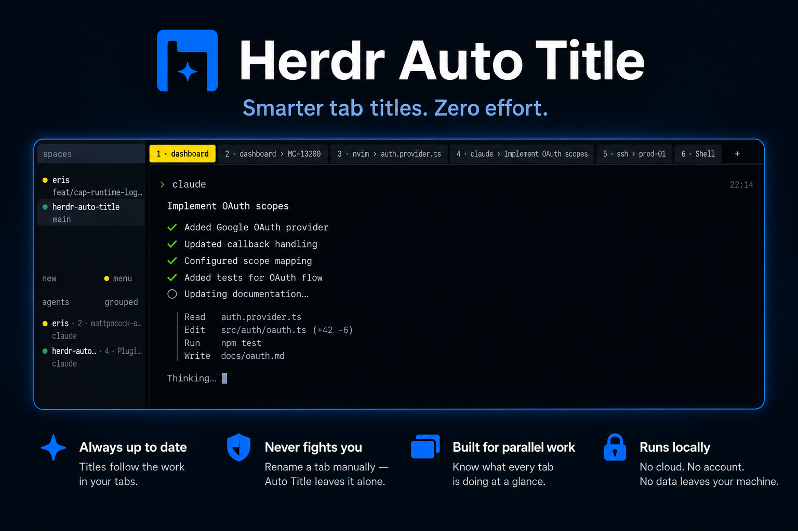

<div align="center">
  <p>
    
  </p>
  <p>
    <a href="https://github.com/kryptamine/herdr-auto-title/actions/workflows/ci.yml"></a>
    <a href="https://github.com/kryptamine/herdr-auto-title/releases"></a>
    <a href="https://go.dev"></a>
    <a href="LICENSE"></a>
  </p>
</div>

A [Herdr](https://herdr.dev) plugin that reads your session twice a second and
keeps every tab's title in step with the work in it. Rename a tab yourself and
it leaves that tab alone from then on.

## Demo

https://github.com/user-attachments/assets/94d9f4f3-b986-4664-a9bc-d078ece4f05e

## Quick start

> [!NOTE]
> Requires Herdr 0.8.2+ and Go 1.24+ on macOS or Linux. Herdr compiles the
> plugin from source on your machine when it installs it.

```sh
herdr plugin install kryptamine/herdr-auto-title
```

> [!IMPORTANT]
> Installing does not start the plugin. Plugins are started by the Herdr
> **server**, and only when it restores a session, so run this once:
>
> ```sh
> herdr server stop   # closes the session; `herdr` brings it back
> ```
>
> Reopening your terminal will not do: that attaches a new client and leaves
> the server, and your plugin, exactly as they were.

Herdr clones the repository, builds the binary and registers it. Until the
server has restarted, nothing is renamed. `herdr plugin list` shows the plugin,
`herdr plugin disable` turns it off.

### Better names for agent tabs

A coding agent usually says what it is working on through its terminal title,
and that is where Auto Title reads it. Claude Code has one blind spot: a session
you opened with a slash command and never typed a prompt into is never given a
title, so its tab stays `claude`. One command closes it:

```sh
herdr integration install claude
```

That is Herdr's own hook, not this plugin's. It tells Herdr which session each
pane is holding, which lets Auto Title read the topic from the session itself.
Reading transcripts can be turned off with `HERDR_AUTO_TITLE_TRANSCRIPT=false`.

**Only Claude Code is read so far.** Herdr installs the same hook for seventeen
agents (`herdr integration status`), and Auto Title accepts the session it
reports from any of them — but every agent keeps its own transcript in its own
format, so each needs a reader of its own:

- [x] `claude` — Claude Code
- [ ] `antigravity-cli`
- [ ] `codex`
- [ ] `copilot`
- [ ] `cursor`
- [ ] `devin`
- [ ] `droid`
- [ ] `grok`
- [ ] `hermes`
- [ ] `kilo`
- [ ] `kimi`
- [ ] `mastracode`
- [ ] `omp`
- [ ] `opencode`
- [ ] `pi`
- [ ] `qodercli`
- [ ] `qwen`

An agent that is not ticked loses nothing: its tab is named from its terminal
title, exactly as before.

Working on the plugin rather than using it? [Development](docs/development.md)
covers linking a local checkout, which Herdr makes you unlink before `install`
will run.

## What your tabs will be called

```
~/work/dashboard                       →  1 · dashboard
~/work/dashboard on feature/MC-13200   →  2 · dashboard › MC-13200
nvim editing auth.provider.ts          →  3 · nvim › auth.provider.ts
an agent working on OAuth scopes       →  4 · dashboard › claude › Implement OAuth scopes
ssh into prod-01                       →  5 · ssh › prod-01
$HOME                                  →  6 · Shell
```

Titles read `<position> · <context> › <activity>`, capped at 64 columns of the
tab bar. The activity is the first of these that has something to say: what an
agent reports it is working on, then the terminal title, then a lone program in
the pane. The context is the directory you are in, or the machine you reached
over `ssh`, and the branch you have checked out qualifies it.

These rules explain most surprises:

- **The number in front is the tab's place in the workspace**, which is the key
  that switches to it. It leads the title because the tab bar cuts the tail of
  a title too wide for it, and it moves with the tab when one to its left
  closes. `HERDR_AUTO_TITLE_POSITION=false` leaves it out.
- Auto Title never repeats your workspace name, because Herdr already shows it
  above the tabs.
- **A branch shows when it distinguishes.** Your repository's own default
  branch says nothing, so it is left out; anything else is shown, shortened to
  what identifies it (`bugfix-asa-cpanel-uapi-mc-13675` → `MC-13675`) when it is
  too long for the tab bar.
- It drops paths, shell prompts and bare program names, which only say again
  where you are.
- A tab with several panes takes its name from one of them: the focused pane, a
  pane running a busy agent, or the pane that changed last.
- **A tab you renamed is yours.** Auto Title never touches it again.
- An agent tab can also be named from the agent's own session — see
  [better names for agent tabs](#better-names-for-agent-tabs).

> [!WARNING]
> Renaming it again does not hand it back. To get automatic naming for that tab,
> stop the plugin, delete its entry from `manual-names.json` (or delete the
> whole file), and start the plugin again.

## Documentation

- [Architecture](docs/architecture/) — how it works and why: the poll loop, how
  a tab becomes a name, and the measured facts about the Herdr socket API.
- [Development](docs/development.md) — working on it.
